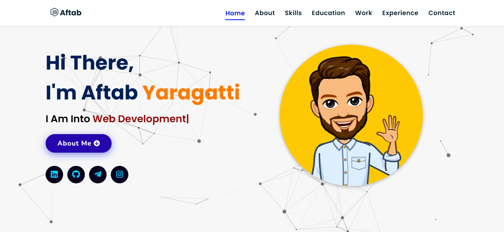
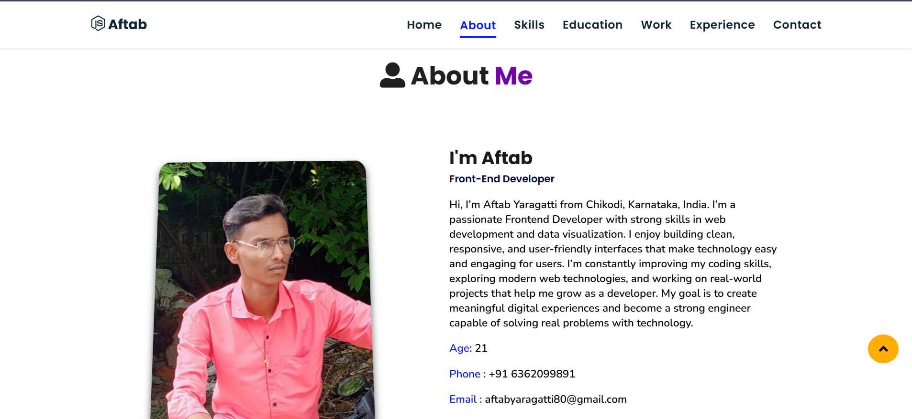
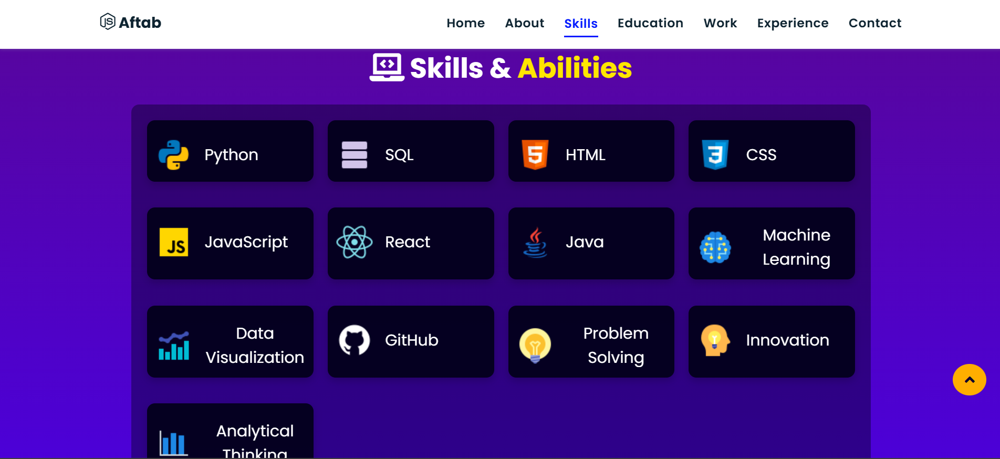
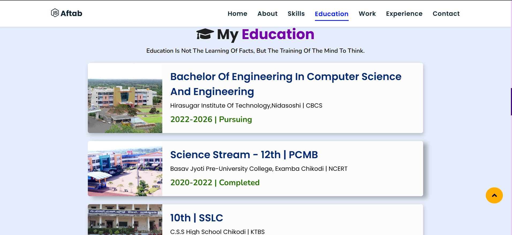
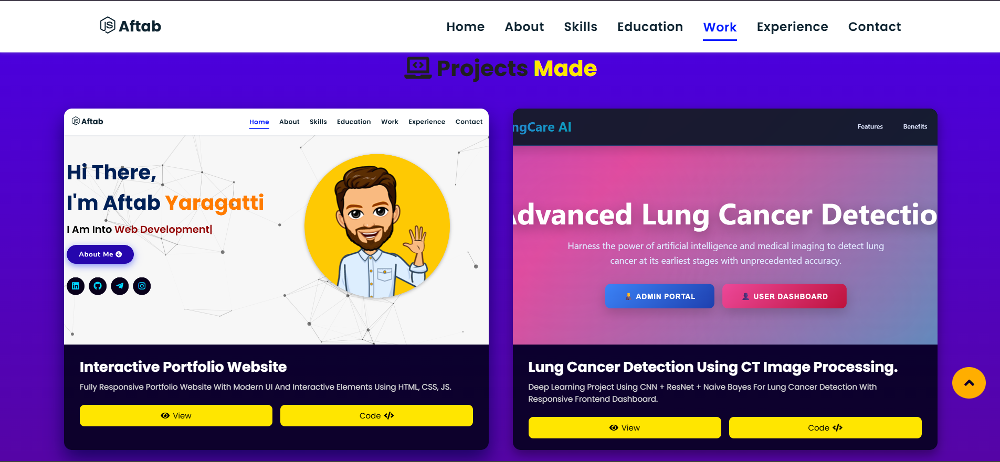
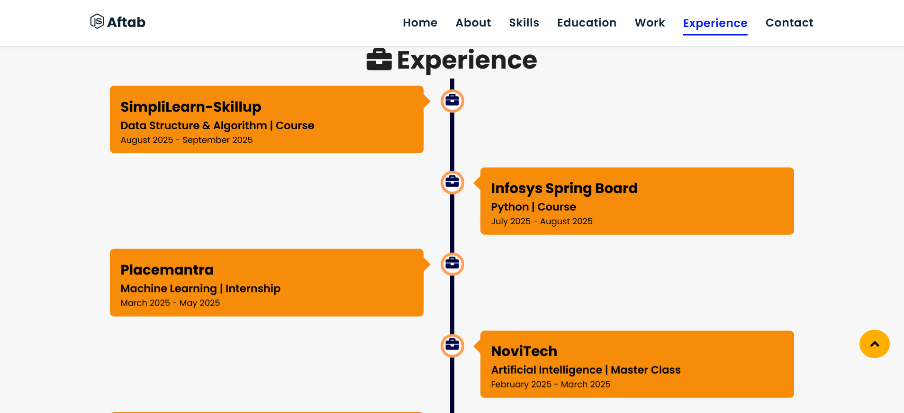
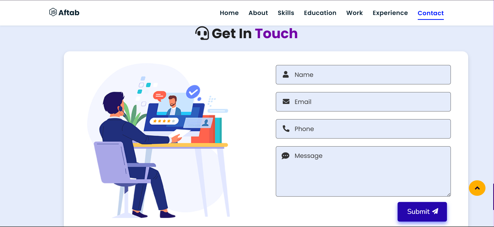
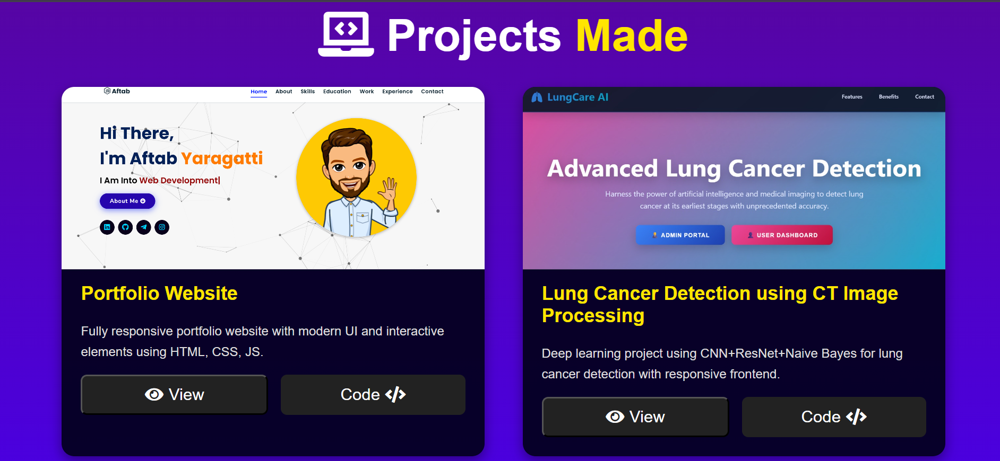
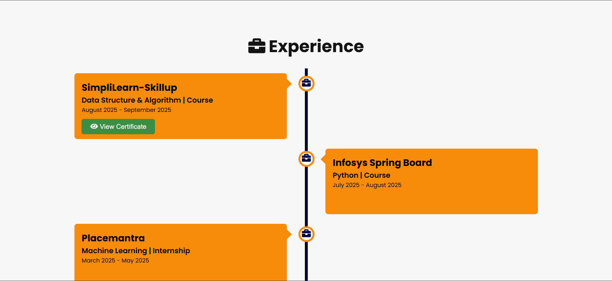
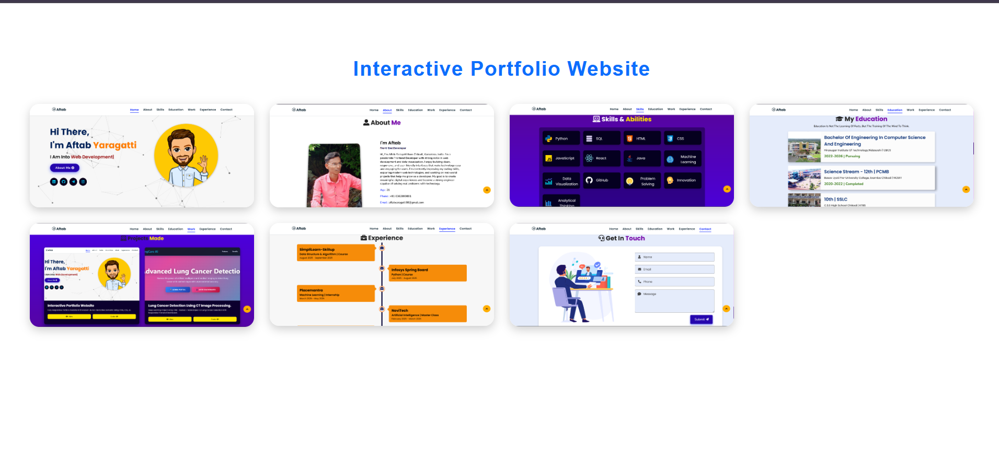

<p align="center">
  
</p>

# 🌟 Interactive Portfolio Website

Welcome to my **Interactive Portfolio Website**!  
This is a fully responsive, professional portfolio built with **HTML, CSS & JavaScript**, designed to showcase my skills, projects, experiences, and interactive UI features — all in one place.

---

## 🚀 Live Preview

👉 Visit Live Site:  
🔗 https://aftabyaragatti.github.io/Interactive-Portfolio-Website

Explore on both **desktop and mobile** devices for the best experience!

---

## 🧱 About This Project

This portfolio is more than static pages — it’s interactive and modern 💼. It includes:
- Smooth navigation and scrolling
- Interactive skill & project sections
- Responsive design for all devices
- Clean and modern UI

This project demonstrates my **front-end web development skills** and design approach.

---

## 🛠️ Technologies Used

| Technology | Purpose |
|------------|---------|
| 📌 HTML5 | Structure of the website |
| 🎨 CSS3 | Styling & layout |
| ⚙️ JavaScript | Interactivity & UI logic |
| 📊 JSON | Skills & project data |

---

## 📸 Screenshots
<p align="center">
  
  
  
  
  
  
  
  
  
  
</p>
---

## 📂 Project Structure

```
Interactive-Portfolio-Website/
├── assets/
├── experience/
├── project/
├── screenshots/
│   ├── desktop.png
│   ├── mobile.png
│   └── projects.png
├── index.html
├── skills.json
├── style.css
└── script.js
```

---

## 🧠 What I Learned

Working on this project helped me improve:
- 📐 Responsive web design
- 🧩 DOM manipulation with JavaScript
- 🎯 UI/UX thinking for real users
- ⚡ Loading data via JSON
- 📦 Structuring frontend projects professionally

---

## ⭐ Features

✔ Smooth navigation menu  
✔ Interactive project cards  
✔ Responsive layout for all screen sizes  
✔ Organized skills and experience section  
✔ Hosted with GitHub Pages

---

## 📌 How to use locally

1. Clone the repo  
```bash
git clone https://github.com/AftabYaragatti/Interactive-Portfolio-Website.git
```

2. Open with any code editor

3. Run `index.html` in your browser

---

## 👨‍💻 About Me

**Aftab Yaragatti**  
Frontend Developer | Python Programmer | AIML Enthusiast

🔗 GitHub: https://github.com/AftabYaragatti  
🔗 LinkedIn: https://www.linkedin.com/in/aftab-yaragatti
🔗 Instagram: https://www.instagram.com/ak_aftab143 

---

⭐ If you find this project useful or inspiring, consider giving it a **star**!

